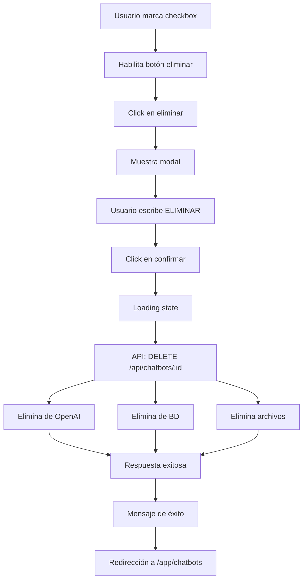

# 🗑️ Implementación de Eliminación de Chatbots - Velvz

## 📋 Resumen del Proyecto

Implementación de la funcionalidad completa para eliminar chatbots de forma permanente en la plataforma Velvz, incluyendo eliminación de:

- Base de datos
- Recursos de OpenAI (Assistant + Vector Store)
- Archivos asociados
- Historial de conversaciones
- Estadísticas

## 🔄 Estado Actual

### ✅ Completado

1. **Limpieza del código anterior** (defectuoso)

   - Eliminado el modal HTML que aparecía bajo el footer
   - Eliminado todo el JavaScript de la implementación anterior
   - Mantenida la interfaz visual de "Zona de Peligro"

2. **Paso 1: Lógica básica del checkbox**
   - Checkbox habilita/deshabilita el botón de eliminar
   - Estados visuales del botón (habilitado/deshabilitado)
   - Event listeners básicos implementados

### 🚧 En Progreso

- **Paso 2: Modal de confirmación**

### 📝 Pendiente

- Pasos 3-8 (ver plan detallado abajo)

## 🏗️ Arquitectura de la Solución

### Frontend

```
/app/chatbots/config.html          # Página de configuración con "Zona de Peligro"
├── configuration-section.js       # Lógica del checkbox y botón
├── configuration-section.css      # Estilos de la tarjeta de peligro
└── [nuevo] delete-modal.js        # Lógica del modal (próximo paso)
```

### Backend (Existente)

```
DELETE /api/chatbots/:id          # Endpoint para eliminar chatbot
├── Validación de propiedad
├── Eliminación de OpenAI
└── Eliminación de BD
```

## 📐 Plan de Implementación

### Paso 1: Checkbox y Botón ✅

- Implementar lógica del checkbox "Entiendo que esta acción..."
- Habilitar/deshabilitar botón según estado del checkbox
- Añadir event listeners básicos

### Paso 2: Modal de Confirmación 🚧

- Crear modal HTML dinámicamente en JavaScript
- Input para escribir "ELIMINAR"
- Validación en tiempo real del texto
- Botones de cancelar y confirmar

### Paso 3: Integración con API

- Conectar con `window.dashboardAPI.deleteChatbot()`
- Manejo de estados de carga
- Feedback visual durante el proceso

### Paso 4: Verificación de Eliminación en OpenAI

- Llamada al endpoint con parámetro `permanent=true`
- Verificar eliminación del Assistant
- Verificar eliminación del Vector Store

### Paso 5: Limpieza de Archivos

- Eliminar archivos subidos del servidor
- Limpiar referencias en la base de datos

### Paso 6: Feedback al Usuario

- Mensajes de éxito/error claros
- Loading states durante el proceso
- Redirección después de eliminar

### Paso 7: Prevención de Errores

- Confirmación doble (checkbox + escribir "ELIMINAR")
- Validación de que el chatbot existe
- Manejo de errores de red

### Paso 8: Testing y Refinamiento

- Pruebas de eliminación completa
- Verificar que no queden recursos huérfanos
- Optimización de UX

## 🔒 Medidas de Seguridad

1. **Doble confirmación**

   - Checkbox obligatorio
   - Escribir "ELIMINAR" en el modal

2. **Validación backend**

   - Verificar propiedad del chatbot
   - Autenticación requerida

3. **Eliminación en cascada**
   - OpenAI Assistant
   - Vector Store
   - Archivos
   - Conversaciones
   - Estadísticas

## 🛠️ Tecnologías Utilizadas

- **Frontend**: Vanilla JavaScript, CSS personalizado
- **Backend**: Node.js + Express
- **Base de datos**: PostgreSQL
- **APIs externas**: OpenAI API
- **Autenticación**: Firebase Auth

## 📊 Flujo de Eliminación



## 🐛 Problemas Conocidos Resueltos

1. **Modal aparecía bajo el footer**

   - Causa: HTML del modal mal posicionado
   - Solución: Eliminado completamente para reimplementar

2. **Funciones no definidas**
   - Causa: Referencias a funciones inexistentes
   - Solución: Limpieza completa del código

## 📝 Notas de Desarrollo

- La eliminación es **permanente e irreversible**
- Se eliminan TODOS los recursos asociados
- El proceso puede tardar varios segundos (OpenAI API)
- Se debe mostrar feedback claro durante todo el proceso

## 🔄 Próximos Pasos Inmediatos

1. **Crear el modal de confirmación** (Paso 2)
2. **Implementar validación del input "ELIMINAR"**
3. **Conectar con la API de eliminación**

## 📚 Referencias

- [OpenAI API - Delete Assistant](https://platform.openai.com/docs/api-reference/assistants/deleteAssistant)
- [OpenAI API - Delete Vector Store](https://platform.openai.com/docs/api-reference/vector-stores/deleteVectorStore)
- Dashboard API: `/assets/js/dashboard-api.js`

---

_Última actualización: Implementación Paso 1 completado_
